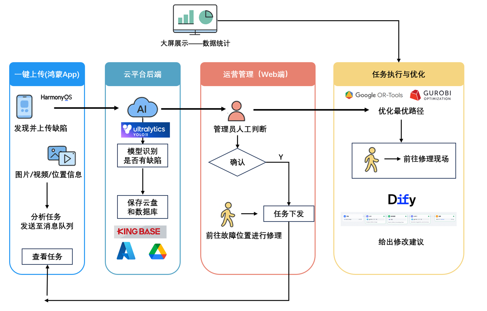

<div align="center">
  <h1>智能巡线车云端数据平台</h1>
  <p>🚄地铁 AGV 巡检 · 数据驱动 · 智能运维🚄</p>
  <a href="https://github.com/anncwb/vue-vben-admin">
    
  </a>
</div>

---

## 项目简介

本平台专为地铁巡线车（AGV）作业数据管理与分析而生，集任务调度、缺陷管理、数据可视化、大屏展示、系统监控于一体。通过统一 Web 端，助力运维团队高效掌控巡检全流程，提升巡检效率与故障响应能力。

项目基于 [Vue Vben Admin](https://github.com/vbenjs/vue-vben-admin) 深度定制，融合现代前端技术栈（Vue3、Vite、TypeScript），并针对实际业务场景对权限系统、动态路由、数据大屏等模块做了大量优化。

> **Vben 框架的优势与挑战：**
>
> - 🚀 动态权限系统灵活强大，适配多角色多部门复杂组织结构。
> - 🧩 丰富的组件库与主题系统，极大提升开发效率与用户体验。
> - ⚡ 动态菜单与路由体系，支持业务模块灵活扩展。
> - 🔒 深度定制权限与数据隔离，开发难度高但安全性极佳。

---

<div align="center">
  
</div>

---

## 👤 目标用户

- 地铁运维管理人员
- 巡线车调度员
- 数据分析与决策者

---

## 🌟 核心功能

1. **任务管理**：巡检任务分配、进度跟踪、详情一览。
2. **缺陷管理**：缺陷发现、分级标注、整改闭环，支持多媒体资料上传。
3. **数据可视化**：大屏展示巡检进度、缺陷分布、人员统计等关键指标。
4. **个人中心**：用户信息管理、权限范围自适应。
5. **系统管理**：账号、角色、菜单、部门等模块权限配置，基于 RBAC。
6. **系统日志与监控**：操作日志、服务状态、资源占用等后台监控。

---

## 🖥️ 页面流程

1. 登录即见数据大屏，掌握全局统计与最新告警。
2. 导航进入任务模块，浏览与处理巡检任务。
3. 缺陷管理支持整改跟踪与多媒体资料上传。
4. 个人信息维护，权限自适应展示。
5. 管理员后台可查日志、监控服务并配置系统。

---

## 🛠️ 技术选型与开发优势

- **前端框架**：Vue3 + Vben Admin，现代化开发体验
- **类型安全**：TypeScript 全量支持，代码健壮
- **高扩展性**：Vben 丰富组件与插件，业务快速扩展
- **权限系统**：RBAC 动态权限，适配复杂组织结构
- **国际化/主题**：多语言与主题切换，适配多场景

---

## 🚀 快速开始

```bash
# 克隆项目
 git clone https://github.com/ZBoyn/SmartCarFrontend

# 安装依赖
 npm i -g corepack
 pnpm install

# 启动项目
 pnpm dev

# 构建发布
 pnpm build
```

---

## 🤝 贡献与反馈

欢迎提交 Issue 或 Pull Request 参与共建！

---

## License

[MIT](./LICENSE)
